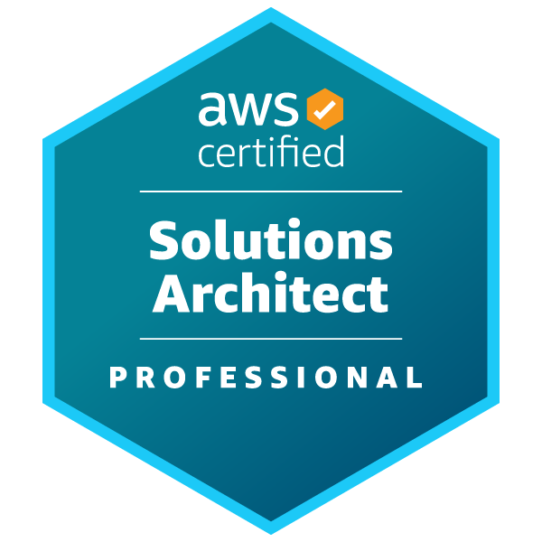
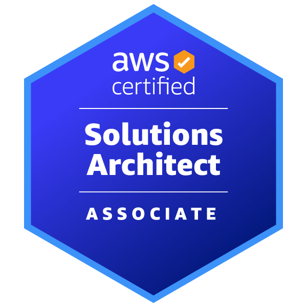
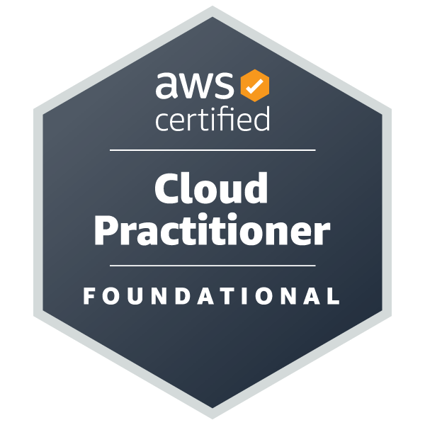
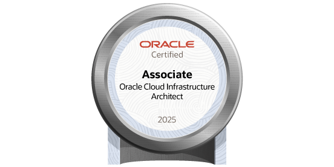
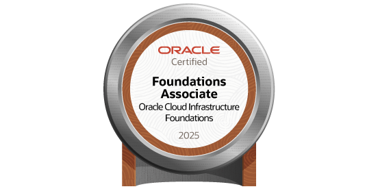

# 🏆 Certificações Profissionais

<div align="center">


**Portfólio de Certificações em Cloud Computing e Tecnologias Microsoft**

[AWS Certifications](#-aws-certifications) • [OCI Certifications](#-oracle-cloud-infrastructure-oci) • [Cursos Especializados](#-cursos-especializados-aws)

</div>

---

## 👨‍💻 Sobre

Profissional certificado em **AWS** e **Oracle Cloud Infrastructure (OCI)** com especialização em arquitetura de soluções, workloads Microsoft e otimização de custos em nuvem.

### 📊 Estatísticas

- 🎓 **3 Certificações AWS** (incluindo Professional)
- 🎓 **2 Certificações OCI**
- 📚 **9+ Cursos Especializados** em Microsoft Workloads na AWS
- 🚀 **Foco:** Arquitetura de Soluções, FinOps e Migração para Cloud

---

## 🌟 Certificações Principais

### 🏅 AWS Certified Solutions Architect - Professional

<div align="center">



**Nível:** Professional | **Validade:** 3 anos | **Obtida:** 2026

</div>

A certificação mais avançada da AWS em arquitetura de soluções, demonstrando expertise em:
- ✅ Design de arquiteturas complexas e escaláveis
- ✅ Migração de aplicações para AWS
- ✅ Otimização de custos e performance
- ✅ Segurança e conformidade
- ✅ Disaster Recovery e Business Continuity

---

## 🎯 AWS Certifications

### 1. AWS Certified Solutions Architect - Professional

<table>
<tr>
<td width="150">

</td>
<td>

**Nível:** Professional

**Habilidades Validadas:**
- Design de arquiteturas híbridas e multi-cloud
- Estratégias de migração complexas
- Otimização de custos em larga escala
- Arquiteturas de alta disponibilidade e disaster recovery
- Segurança avançada e compliance

**Áreas de Conhecimento:**
- Design for Organizational Complexity
- Design for New Solutions
- Continuous Improvement for Existing Solutions
- Accelerate Workload Migration and Modernization

</td>
</tr>
</table>

### 2. AWS Certified Solutions Architect - Associate

<table>
<tr>
<td width="150">

</td>
<td>

**Nível:** Associate

**Habilidades Validadas:**
- Design de sistemas distribuídos resilientes
- Arquiteturas de alta performance
- Aplicações seguras
- Otimização de custos

**Serviços Principais:**
- EC2, S3, RDS, VPC, Lambda
- CloudFormation, CloudWatch
- IAM, Route 53, ELB

</td>
</tr>
</table>

### 3. AWS Certified Cloud Practitioner

<table>
<tr>
<td width="150">

</td>
<td>

**Nível:** Foundational

**Habilidades Validadas:**
- Conceitos fundamentais de cloud
- Serviços principais da AWS
- Segurança e compliance
- Modelos de precificação

**Conhecimentos:**
- Cloud Computing Concepts
- AWS Global Infrastructure
- AWS Services and Use Cases
- Billing and Pricing

</td>
</tr>
</table>

---

## 🔶 Oracle Cloud Infrastructure (OCI)

### 1. OCI 2025 Cloud Architect Associate

<table>
<tr>
<td width="150">

</td>
<td>

**Nível:** Associate

**Habilidades Validadas:**
- Design de arquiteturas OCI
- Compute, Storage e Networking
- Database e Analytics
- Segurança e Identity Management

**Áreas de Conhecimento:**
- OCI Architecture and Services
- Compute and Storage Solutions
- Networking and Connectivity
- Security and Compliance

</td>
</tr>
</table>

### 2. OCI 2025 Foundations Associate

<table>
<tr>
<td width="150">

</td>
<td>

**Nível:** Foundational

**Habilidades Validadas:**
- Conceitos fundamentais de OCI
- Serviços principais
- Pricing e Support
- Segurança básica

**Conhecimentos:**
- OCI Core Services
- Identity and Access Management
- Networking Fundamentals
- Cost Management

</td>
</tr>
</table>

---

## 📚 Cursos Especializados AWS

### Microsoft Workloads on AWS

Especialização completa em execução de workloads Microsoft na AWS:

#### 🎓 Cursos Concluídos

1. **[Microsoft Workloads on AWS Learning Plan](aws/courses/e9f6769f-8bf4-473c-8c88-d22292d1ebbb.pdf)**
   - Plano completo de aprendizado para workloads Microsoft

2. **[Microsoft on AWS - Porting Assistant for .NET](aws/courses/afe97cf2-b1bc-4c42-86a4-9732742ed6ac.pdf)**
   - Migração de aplicações .NET para AWS

3. **[AWS Partner: AWS for Microsoft Workloads (Business)](aws/courses/20d910b9-c81a-4d36-a571-e97abbede41b.pdf)**
   - Aspectos de negócio para workloads Microsoft

4. **[Monitor .NET applications using Amazon CloudWatch Application Signals](aws/courses/d8b92719-b8c3-438e-8f59-7ceaad7626a3.pdf)**
   - Monitoramento avançado de aplicações .NET

5. **[Choosing Serverless Containers for .NET](aws/courses/6ec079e0-3c0b-411b-a357-004874f75b7e.pdf)**
   - Containers serverless para .NET

6. **[AWS Tools to Develop, Run, and Modernize .NET Workloads](aws/courses/247d60a9-974c-4cd2-b27f-3cf1553c511e.pdf)**
   - Ferramentas AWS para desenvolvimento .NET

7. **[Optimizing Costs for Microsoft Workloads on AWS](aws/courses/10d17b0c-1109-4887-8e66-861263710c5b.pdf)**
   - Otimização de custos para workloads Microsoft

8. **[Microsoft on AWS - Migrate SQL Server Databases to Aurora](aws/courses/9d20636e-c475-428f-ad05-ccbc5f69a0bb.pdf)**
   - Migração de SQL Server para Aurora

9. **[Containerize and Run .NET Applications on Amazon EKS Windows Pods](aws/courses/afa70cac-3779-4d40-9e08-9fef34346c1a.pdf)**
   - Containerização de aplicações .NET no EKS

---

## 🎯 Áreas de Expertise

### Cloud Architecture
- ☁️ Design de arquiteturas multi-cloud (AWS + OCI)
- 🏗️ Arquiteturas serverless e event-driven
- 🔄 Disaster Recovery e Business Continuity
- 📈 Auto-scaling e alta disponibilidade

### Microsoft Workloads
- 🖥️ Migração de aplicações .NET para AWS
- 💾 SQL Server e Aurora PostgreSQL
- 🐳 Containerização com EKS Windows
- 📊 Monitoramento com CloudWatch

### FinOps & Optimization
- 💰 Otimização de custos em cloud
- 📊 Análise de utilização de recursos
- 🔍 Right-sizing de instâncias
- 📈 Reserved Instances e Savings Plans

### DevOps & Automation
- 🔧 Infrastructure as Code (Terraform, CloudFormation)
- 🤖 CI/CD Pipelines
- 📦 Containerização e Orquestração
- 🔄 Automação com Ansible/AWX

---

## 📈 Jornada de Certificação

```
2023
├── AWS Certified Cloud Practitioner ✅
└── OCI Foundations Associate ✅

2024
├── AWS Certified Solutions Architect - Associate ✅
└── OCI Cloud Architect Associate ✅

2025-2026
├── AWS Certified Solutions Architect - Professional ✅ 🎉
└── 9+ Cursos Especializados em Microsoft Workloads ✅
```

---

## 🎓 Próximas Certificações

### Em Planejamento

- [ ] AWS Certified DevOps Engineer - Professional
- [ ] AWS Certified Security - Specialty
- [ ] AWS Certified Advanced Networking - Specialty
- [ ] HashiCorp Certified: Terraform Associate

---

## 🔗 Links Úteis

### Verificação de Certificados

- **AWS Certifications:** [Credly Profile](https://www.credly.com/)
- **Oracle Certifications:** [Oracle Certification Verification](https://education.oracle.com/certification)

### Recursos de Estudo

- [AWS Training and Certification](https://aws.amazon.com/training/)
- [Oracle University](https://education.oracle.com/)
- [AWS Well-Architected Framework](https://aws.amazon.com/architecture/well-architected/)

---

## 📊 Badges Digitais

<div align="center">

[](https://aws.amazon.com/certification/certified-solutions-architect-professional/)
[](https://aws.amazon.com/certification/certified-solutions-architect-associate/)
[](https://aws.amazon.com/certification/certified-cloud-practitioner/)

[](https://education.oracle.com/oracle-cloud-infrastructure-2025-architect-associate/pexam_1Z0-1072-25)
[](https://education.oracle.com/oracle-cloud-infrastructure-2025-foundations-associate/pexam_1Z0-1085-25)

</div>

---

## 💼 Aplicação Prática

### Projetos Relacionados

- 🚀 **[InfraOps-AWX](https://github.com/bruno0nline/InfraOps-AWX)** - Automação de infraestrutura com AWX
- 📊 **[OCI FinOps Analyzer](https://github.com/bruno0nline/OCI_FinOps_Analyzer)** - Otimização de custos OCI

---

## 👤 Contato

**Bruno Mendes Augusto**

- 💼 LinkedIn: [Bruno Mendes Augusto](https://linkedin.com/in/bruno-mendes-augusto)
- 📧 Email: brunomendesaugusto@gmail.com
- 🐙 GitHub: [@bruno0nline](https://github.com/bruno0nline)

---

## 📝 Notas

> 💡 **Dica:** Todas as certificações AWS são válidas por 3 anos e requerem recertificação. As certificações OCI seguem o modelo de versionamento anual.

> 🔒 **Verificação:** Todos os certificados podem ser verificados através dos links oficiais da AWS e Oracle.

---

<div align="center">

**⭐ Comprometido com aprendizado contínuo e excelência técnica**


</div>
